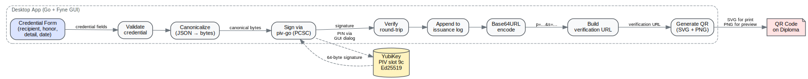
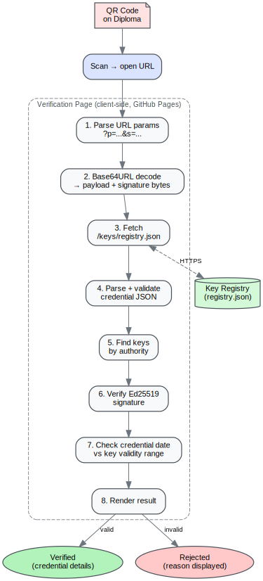
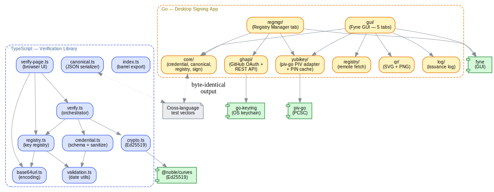

# Architecture

## System Overview

The RHG Authenticator is a credential verification system with three principals:

- **Issuer** (the Prince) — Signs credentials with a hardware security key (YubiKey)
- **Holder** (the recipient) — Receives a physical diploma with a QR code
- **Verifier** (anyone) — Scans the QR code to verify authenticity via a public web page

No blockchain, no third-party verification services. Trust is rooted in Ed25519 public key cryptography and a public key registry hosted alongside the verification page.

## Threat Model

- **Trust anchor**: The YubiKey hardware token. Private key never leaves the device.
- **Public registry**: `keys/registry.json` is hosted on GitHub Pages. Integrity is protected by GitHub account access controls.
- **Verification is client-side**: The public verification page fetches the registry and performs all crypto in the browser — no server round-trip.
- **Signing server is localhost-only**: The signing server binds to `127.0.0.1` and is single-user. Network threats are out of scope.
- **QR as transport**: The QR code is a URL containing the full signed credential. No database lookup required.

### Accepted Risks

- **Timing side channel in verification diagnostics**: Date-mismatch diagnostics reveal whether a valid signature exists outside the date range. This is intentional UX — the registry is public anyway.
- **Public key registry is public**: By design. The security property is that only the holder of the YubiKey private key can produce valid signatures.
- **SSRF DNS rebinding residual**: Pre-fetch DNS resolution check narrows the window, but DNS rebinding can still return a safe IP for our lookup and a private IP for Node's `fetch()`. Accepted because the registry URL is operator-set config, not untrusted input.
- **PIN in `/proc/PID/cmdline`**: `yubico-piv-tool` requires literal `-P <pin>` on the command line. Visible to same-UID processes for milliseconds during signing. Accepted for single-user localhost.

## Data Flow

### Issuance Flow



### Verification Flow



## Module Architecture



### Module Responsibilities

| Module | Responsibility | External Deps |
|--------|---------------|---------------|
| `canonical.ts` | Deterministic JSON serialization (key-sort, NFC, no whitespace) | None |
| `base64url.ts` | Base64URL encode/decode, standard Base64 decode | None (uses `btoa`/`atob`) |
| `credential.ts` | Credential v1 schema validation, arithmetic date checking, `sanitizeForError` | `validation.ts` |
| `crypto.ts` | Ed25519 sign, verify (`zip215: false`), getPublicKey | `@noble/curves` |
| `registry.ts` | Registry schema validation, authority lookup, SPKI key decoding | `base64url.ts`, `validation.ts` |
| `validation.ts` | Shared date validation (calendar-correct, no `Date` constructor) | None |
| `verify.ts` | Single-pass verification orchestrator | `credential.ts`, `crypto.ts`, `registry.ts` |
| `index.ts` | Barrel export | All core modules |
| `verify-page.ts` | Browser verification page: URL parsing, registry fetch, DOM rendering | `verify.ts`, `base64url.ts`, `registry.ts` |
| `issuer.ts` | Pure issuer logic: QR/URL constants, form validation, URL length estimation, error formatting | `canonical.ts`, `base64url.ts`, `validation.ts` |
| `issuer-page.ts` | Browser issuer page: auth, form, QR rendering, download/copy actions | `issuer.ts`, `qrcode` |
| `server/types.ts` | Shared types: `SigningAdapter`, `ServerConfig`, `IssuanceRecord` | None |
| `server/cli.ts` | CLI entry point, argument parsing, signal handling | `server/main.ts` |
| `server/main.ts` | Server startup: token gen, key export, registry fetch, HTTP server | `server/http.ts`, `server/yubikey.ts`, `server/registry-fetch.ts`, `server/key-match.ts` |
| `server/http.ts` | Request handler: routing, CORS, auth, rate limiting, static files | `server/sign.ts`, `server/key-match.ts` |
| `server/sign.ts` | Signing orchestrator: validate → canonicalize → sign → verify → log | `server/signature.ts`, `server/log.ts`, core library |
| `server/signature.ts` | Ed25519 signature length validation (64 bytes) | None |
| `server/registry-fetch.ts` | Remote registry fetch with SSRF validation + local fallback | `credential.ts`, `registry.ts` |
| `server/key-match.ts` | Match public key against registry entries by date | `registry.ts` |
| `server/log.ts` | Atomic append-only issuance log (tmp + rename) | None |
| `server/yubikey.ts` | YubiKey PIV adapter via `yubico-piv-tool` CLI | `registry.ts`, `server/signature.ts` |

## Credential Format

### Schema (v1)

```typescript
type CredentialV1 = {
  authority: string;   // Formal title of the signer
  date: string;        // ISO 8601 date (YYYY-MM-DD)
  detail: string;      // Specific distinction or rank
  honor: string;       // Title of the honor bestowed
  recipient: string;   // Full name of the recipient
  version: 1;          // Schema version
};
```

All six fields are required. No extra fields allowed. Strings must be non-empty with no leading/trailing whitespace.

### Canonical Form

Before signing, the credential is serialized to canonical JSON:

1. Object keys sorted lexicographically at all levels
2. Strings NFC-normalized (Unicode normalization)
3. No whitespace between tokens
4. Standard JSON escaping

The canonical bytes are what gets signed and included in the URL (not a re-serialization).

### URL Encoding

```
https://verify.royalhouseofgeorgia.ge/?p=<payload>&s=<signature>
```

- `p` = Base64URL(canonical JSON bytes)
- `s` = Base64URL(64-byte Ed25519 signature)

Total URL must fit within QR Version 24-Q capacity. Conservative limit is 625 chars (true V24-Q byte-mode capacity is 661). Fixed overhead is ~132 chars, leaving ~493 chars for the base64url-encoded payload.

### QR Code Specification

| Parameter | Value | Rationale |
|-----------|-------|-----------|
| Version | 24 (fixed) | 113×113 modules; fits credentials up to 625 chars |
| Error correction | Q (25%) | Tolerates moderate damage to printed diplomas |
| Max URL length | 625 chars | Conservative limit (true capacity 661) |
| Render width | 2048px | High-res PNG for print (minimum 6.1×6.1 cm) |
| Preview width | 512px | Screen preview in issuer UI |
| Quiet zone | 4 modules | Per QR spec |

## Key Registry

### Schema

```typescript
type KeyEntry = {
  authority: string;        // Must match credential's authority field
  from: string;             // Start of validity (YYYY-MM-DD, inclusive)
  to: string | null;        // End of validity (inclusive) or null (no expiration)
  algorithm: 'Ed25519';     // Only Ed25519 supported
  public_key: string;       // Base64: 44-byte SPKI DER or 32-byte raw
  note: string;             // Human-readable description
};

type Registry = { keys: KeyEntry[] };
```

### Key Rotation

The registry supports multiple keys per authority with non-overlapping date ranges:

```json
{
  "keys": [
    { "authority": "Prince", "from": "2025-01-01", "to": "2025-12-31", "public_key": "..." },
    { "authority": "Prince", "from": "2026-01-01", "to": null, "public_key": "..." }
  ]
}
```

Verification first tries date-eligible keys. If no match, tries remaining keys and reports a date-mismatch diagnostic if a signature validates outside its key's date range.

### SPKI DER Format

YubiKey-exported public keys are 44 bytes (12-byte SPKI ASN.1 header + 32-byte raw key). The library's `decodePublicKey` strips the header automatically. Raw 32-byte keys are also accepted.

```
Offset  Length  Content
0       12      SPKI header: 302a300506032b6570032100
12      32      Raw Ed25519 public key
```

## Cryptography

### Algorithm Choice

Ed25519 via `@noble/curves` with `zip215: false` for strict RFC 8032 verification. This rejects non-canonical signatures that some implementations accept.

`@noble/curves` was chosen over `@noble/ed25519` because v2 of the latter removed the `zip215: false` option.

### Signing

- **Production**: YubiKey PIV slot 9c via `yubico-piv-tool` (requires PIN + touch)
- **Test/CI**: `@noble/curves` in-memory signing with test keypairs

The signing tool produces a raw 64-byte signature (R ‖ S). No DER wrapping.

### Verification

Verification operates on the original payload bytes, not a re-canonicalized form. This prevents any normalization differences between signing and verification from causing false rejections.

## Security Hardening

Eight rounds of security hardening and two code review rounds applied across Phases 1–4.

### Core Library Defenses

| Defense | Module | Description |
|---------|--------|-------------|
| Prototype pollution | `canonical.ts` | `Object.create(null)` for sorted objects; `__proto__` key rejected |
| Payload size limit | `verify.ts` | `MAX_PAYLOAD_BYTES = 2048` enforced before JSON parsing |
| Log injection | `credential.ts` | `sanitizeForError` strips C0/C1 control characters; used across all modules |
| Base64 length validation | `base64url.ts` | Rejects remainder-1 inputs (never valid Base64) |
| Control character rejection | `credential.ts` | C0/C1 control characters and bidi overrides rejected in all credential string fields |
| Per-field length limits | `credential.ts` | authority: 200, recipient: 500, honor: 200, detail: 2000, date: 10 — compile-time enforced via `satisfies` |
| Extra field rejection | `credential.ts`, `registry.ts` | No unexpected fields pass validation |
| Strict crypto inputs | `crypto.ts` | Length validation on all key/signature/message inputs |
| SPKI prefix verification | `registry.ts` | Byte-by-byte comparison of 12-byte DER header |

### Server Security Defenses

| Defense | Module | Description |
|---------|--------|-------------|
| Bearer token auth | `http.ts` | SHA-256 hashed timing-safe comparison via `timingSafeEqual` |
| Token fingerprint logging | `main.ts` | SHA-256 fingerprint in banner; raw token never logged |
| Origin enforcement | `http.ts` | All POST requests require Origin header; only localhost origins accepted |
| Auth-failure rate limiting | `http.ts` | Exponential backoff after 5 failures (1s–30s), monotonic clock |
| Body size limit | `http.ts` | 64KB max body, 5s read timeout, socket destroyed on violation |
| Signing queue depth | `http.ts` | Max 5 concurrent sign operations (429 overflow) |
| CORS rejection | `http.ts` | Cross-origin requests rejected; no CORS headers exposed |
| CSP headers | `http.ts` | `default-src 'self'`; `script-src 'self'`; `style-src 'self'`; `img-src 'self' data:`; `connect-src 'self'`; `base-uri 'none'`; `form-action 'none'`; `frame-ancestors 'none'` |
| Security headers | `http.ts` | X-Content-Type-Options, X-Frame-Options, Referrer-Policy, Permissions-Policy, Cache-Control |
| TOCTOU-safe static files | `http.ts` | fd-based stat + read on same file descriptor |
| Path traversal protection | `http.ts` | `realpath` resolution + prefix check against `issuerDir` |
| SSRF protection | `registry-fetch.ts` | HTTPS-only, hostname blocklist, pre-fetch DNS resolution with IPv4/IPv6 private range detection |
| Extra-key rejection | `http.ts` | Sign request body rejects unexpected fields beyond the 4 required |
| Stderr cap | `yubikey.ts` | `spawnAsync` limits stderr accumulation to 64KB to prevent unbounded memory growth |
| Token file option | `cli.ts`, `main.ts` | `--token-file <path>` writes bearer token to file with `0o600` permissions for operators who redirect stderr |
| Authority refresh check | `main.ts` | Background registry refresh re-validates YubiKey key is still active; logs warning if revoked |
| Registry size limit | `registry-fetch.ts` | 1MB max response (Content-Length pre-check + body byte count) |
| Atomic log writes | `log.ts` | Write to `.tmp.<random>` then rename; 0o600 permissions |
| Random tmp paths | `yubikey.ts` | `fs.mkdtemp` for signing temp files; cleaned in `finally` block |
| Process timeout | `yubikey.ts` | SIGTERM → 2s → SIGKILL for hung child processes |
| PIN validation | `yubikey.ts` | 6–8 printable ASCII only; non-printable rejected |
| Error sanitization | All server modules | `sanitizeForError` on all logged/returned error details |

### Design Decisions

- **Sync API**: All crypto operations are synchronous. `@noble/curves` is pure JS — no Web Crypto async overhead.
- **No key_id field**: The registry is too small for O(n) lookup to matter. Signature verification is the real authentication gate.
- **Arithmetic date validation**: Uses manual month/day/leap-year checks instead of `Date` constructor, which silently rolls invalid dates (e.g., Feb 30 → Mar 2).
- **Single-pass verification**: Verify signature against all authority-matching keys, with date-mismatch diagnostics for valid-but-expired matches.
- **Global rate limiter**: Localhost single-user tool — per-IP tracking is unnecessary. Valid auth always succeeds (no attacker-triggered lockout).
- **SSRF residual risk accepted**: DNS rebinding can bypass pre-fetch DNS resolution check. Accepted because registry URL is operator-set config, not untrusted input. Pre-fetch check narrows the window significantly.
- **Token in module-scoped closure**: Bearer token stored in a JS variable (not `sessionStorage`) to reduce XSS read surface. Cleared only on page unload or 401 re-auth.

## Completed Phases

### Phase 1: Core Crypto & Data Layer (Complete)

Foundational data structures and cryptographic operations. Credential v1 schema validation, deterministic canonical JSON serialization (key-sort, NFC, no whitespace), Ed25519 sign/verify via `@noble/curves`, public key registry with SPKI DER support, and a two-pass verification orchestrator.

### Phase 2: Verification Page (Complete)

Static HTML/CSS/JS page for GitHub Pages at `verify/`. The Phase 1 library is bundled via esbuild into a single IIFE. The page parses URL parameters (`?p=<payload>&s=<signature>`), fetches the key registry, runs Ed25519 verification client-side, and renders a dignified success/failure/error UI. Mobile-first design (primary use: phone scanning QR). All DOM text via `textContent` for XSS prevention. WCAG AA accessible (color + icon + text label for all states).

### Phase 3: Signing Server (Complete)

Localhost Node.js server interfacing with YubiKey PIV slot 9c. Startup: generate bearer token, export YubiKey public key, fetch and validate registry, match key to authority. HTTP server with `POST /sign` (validate → canonicalize → sign → verify round-trip → log) and `GET /health`. Background registry refresh every 60s. Atomic issuance log with crash-safe tmp+rename writes. Six rounds of security hardening including SSRF protection, CORS/Origin enforcement, auth rate limiting, CSP headers, TOCTOU-safe file serving, and process timeouts.

### Phase 4: Issuer Interface (Complete)

Browser-based credential issuance form served by the signing server. Two-layer architecture: `issuer.ts` (pure logic — QR/URL constants, form validation, URL length estimation, error formatting) and `issuer-page.ts` (browser entry point — DOM construction, auth flow, QR rendering, download/copy).

Key features:
- Token authentication via module-scoped closure (not `sessionStorage`) — XSS-resistant
- Form validation matching server-side rules (honor titles, date format, field lengths)
- Pre-submit URL length check against QR V24-Q capacity (625 chars conservative limit)
- QR code generation via `qrcode` library with forced version 24, error correction Q
- High-resolution PNG download (2048×2048) with SHA-256 content hash in filename
- Clipboard copy with graceful fallback for non-HTTPS contexts
- Print size advisory (minimum 6.1×6.1 cm, recommended 7.3×7.3 cm)
- All DOM text via `textContent` (zero `innerHTML` — XSS-safe)

## Planned Phases

### Phase 5: Desktop App (Electron)

Self-contained desktop application wrapping the signing server and issuer UI. Target: non-technical users who double-click to open, plug in YubiKey, and sign credentials without terminal access.

### Phase 6: Packaging & Deployment

Platform-specific installers (macOS .dmg, Windows .msi, Linux .AppImage/.deb), GitHub Pages configuration for verification page, credential v1 formal specification.
